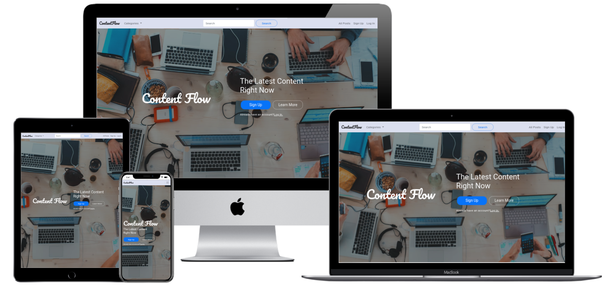
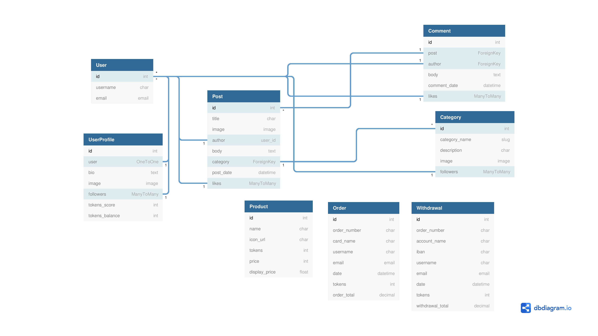

# Website for Content Flow



## Code Institute Milestone Project 4 : Full Stack Frameworks with Django

Content Flow is an online community where users can view and share content in a variety of different categories. Registered users will be able to follow categories and other users of their choice and they will also be able to reward each other with tokens, via their posts. The website will allow users to purchase tokens using the Stripe Authentication Software and users will also be able to convert and withdraw their tokens as cash for financial gain.

The website will feature a landing page with information about the community and how it works, encouraging users to sign up. Users will be able to view the main website and content without signing up, however, they will need a registered account to access the full experience. (post content, comment, likes, send/receive rewards etc.) The website will make use of HTML, CSS and JavaScript for the front end and Python with the Django Framework for the backend. It will also incorporate a PostgreSQL relational database system with full CRUD functionality.

A link to the live website can be found [here.](https://content-flow-ms4.herokuapp.com/)

## Table of Contents

- [User Experience (UX)](#ux)
- [Database Schema](#database-schema)
- [Features](#features)
- [Technologies Used](#technologies-used)
- [Testing](#testing)
- [Deployment](#deployment)
- [Credits](#credits)

## UX

### Strategy

The website for Content Flow is not going to be designed with a specific set of users in mind. As the website will be a place for anyone to view and share content, I want it to appeal to anyone who uses the internet to view content and users will then be able to customise their own experience on the site by filtering content based on their own interests. Upon visiting the website for the first time, users should immediately recognise the purpose of the website and it should not take them long to decide if it is of interest to them or not.

Users will be able to intuitively navigate around the website and view content in categories of their choice. For convenience, users will be able to search for specific categories and posts and they will be able to sort content by date or by most popular. Logged in users will have access to more features such as creating posts, commenting on posts, liking posts, sending/receiving rewards and they will also be able to customise their own content feed by following their favourite categories and users. Admin users will have the ability to edit and delete any post on the website and they will have full CRUD power over the site.

As there is no specific demographic of users - a user is anyone who wants to view or post content online - the user stories are split into first time user, general user, logged-in user and administrator.

User Story No. | As a User | I want to be able to | So that I can | Complete
---------------|-----------|----------------------|---------------|--------------
1|First Time User|immediately recognise the purpose of the site|decide if I am interested in using the site or not| :heavy_check_mark:
2|General User|easily navigate the website on various devices|browse the website without feeling lost or confused| :heavy_check_mark:
3|General User|view a list of post categories|choose which categories I am interested in| :heavy_check_mark:
4|General User|view all posts in a specific category|view the posts I am interested in| :heavy_check_mark:
5|General User|view individual posts|see all post details (comments, author, likes and date posted)| :heavy_check_mark:
6|General User|sort posts by date / popularity|view most recent or most popular posts| :heavy_check_mark:
7|General User|search the website|find and view specific posts, categories and users| :heavy_check_mark:
8|General User|easily register a new account|have the full website experience and contribute to the community| :heavy_check_mark:
9|Logged In User|easily log in / log out|access my own personal account| :heavy_check_mark:
10|Logged In User|create a new post|share content with other users and receive rewards| :heavy_check_mark:
11|Logged In User|comment on a post|personally respond to a post| :heavy_check_mark:
12|Logged In User|like a post|express that I like the content of the post| :heavy_check_mark:
13|Logged In User|follow users/categories|view content that I am interested in on my own personal feed| :heavy_check_mark:
14|Logged In User|send rewards to users for their posts|reward a user for posting good quality content| :heavy_check_mark:
15|Logged In User|receive rewards from users for my posts|be rewarded by other users for posting good quality content| :heavy_check_mark:
16|Logged In User|buy tokens with credit/debit card|add tokens to my account balance| :heavy_check_mark:
17|Logged In User|withdraw tokens as cash|convert my tokens to cash and withdraw to my bank account| :heavy_check_mark:
18|Logged In User|view order details when buying or withdrawing tokens|review my purchase/withdrawal| :heavy_check_mark:
19|Logged In User|receive email confirmation for purchases/withdrawals|keep record of successful transactions| :heavy_check_mark:
20|Logged In User|have a personal profile|view and customise my personal profile and account details| :heavy_check_mark:
21|Logged In User|edit/delete my own posts|edit any errors or remove my post completely| :heavy_check_mark:
22|Logged In User|reset password|access my account if I forget my password| :heavy_check_mark:
23|Logged In User|delete my account|delete my account if I no longer wish to use the website| :heavy_check_mark:
24|Administrator|edit/delete any posts|moderate the website / remove inappropriate content| :heavy_check_mark:

### Scope

After analysing the user stories, I have decided on the following features as my intitial minimum scope.
- Responsive design
- Landing page with information about the website
- User account registration & login/logout functionality
- All users able to view posts with ability to view by category and filter by date/popularity
- Registered users able to create, edit and delete posts of their own
- Registered users able to like and comment on posts an follow specific users/categories
- Registered users able to purchase tokens to reward other users for their posts
- Search functionality to search for posts, categories and users
- Administrators will have full CRUD control to moderate the entire website

### Structure

I did some research on various blogs, social media sites and content sharing sites to get an idea of what kind of designs users are familiar with. Most of these websites shared a similar pattern of a navbar containing a user icon and a search bar at the top of the page and a content feed below it. Some sites also have a text field above the content feed to allow users to create a post instantly and some had some extra content or links to the side of the content feed. On most of the sites that I visited, the purpose of the website is immediately evident, so I decided to base my design around these websites so that users will have a sense of familiarity when visiting. This familiarity will also prevent any steep learning curve that may throw users off using the website.

Another thing I noticed while doing research is that there are a lot of advertisements and promoted content on most of the websites I visited, which I found quite annoying and distracting. I feel the exclusion of this content in my own website will provide users with a friendlier and more enjoyable experience for them while they are browsing through the website content.

The entire website is designed to be easy to navigate with all information presented in a clean manner so that users will have a familiar and enjoyable experience.

I have structured the website with:
- A navbar at the top of the page with a brand logo on the left and nav-items to the right which is common to most websites. The navbar will contain a searchbar for users to search the website
- A collapsible navbar for smaller screens
- Navbar common to all pages - items displayed in navbar depending on user status (log in will not be available for a user already logged in etc.)
- Main content will have a simple layout written with Bootstrap for structure and responsive design
- Landing page, register, login and content pages accessible by all users of the website
- User account settings, user profile, create post, purchase token pages only accessible to logged in users. Unauthorized users trying to access will be prompted to log in.

### Skeleton 

I designed wireframes for desktop, tablet and mobile using Balsamiq. These wireframes can be viewed [here.](https://github.com/shaneoh10/content-flow-ms4/tree/main/assets/wireframes)

### Surface

#### Colours

I decided to use a neutral colour palette for the website so as not to distract users from the main content and to keep the user interface clean. For the user interaction buttons, I decided to use the blue bootstrap primary colour for positive interactions (add post, sign in, follow etc.) and the red bootstrap danger colour for negative interactions (delete etc.). This makes it easier for users to distinguish between which type of action they are trying to take and it provides a good contrast from the neutral colour palette so the buttons stand out well.

- #FAFAFA - Cultured (Off-white)
- #DBDFF0 - Lavendar Web
- #E6F2FF - Alice Blue
- #007BFF - Azure (Bootstrap primary)
- #DC3546 - Rusty Red (Bootstrap danger)

#### Typography

I chose 'Arial' as the main font for the project as it is clean and easy to read, making it a good choice for a website where users will be spending a great deal of time reading through content.

## Database Schema

The project uses a PostgreSQL relational database consisting of the django allauth User model and 7 models created by myself.

### Database Structure

#### Category

Name              |Field Type                                                
------------------|---------------
category_name     |SlugField                                              
description       |CharField                                    
image             |ImageField                                    
followers         |ManyToManyField(User)

#### Post

Name              |Field Type                                                
------------------|---------------
title             |SlugField                                              
image             |ImageField                                    
author            |ForegnKey(User)                                    
body              |RichTextField
category          |ForeignKey(Category)
post_date         |DateTimeField
likes             |ManyToManyField(User)

#### Comment

Name              |Field Type                                                
------------------|---------------
post              |ForeignKey(User)                                              
author            |ForeignKey(User)                                    
body              |TextField(User)                                    
comment_date      |DateTimeField
likes             |ManyToManyField(User)


#### UserProfile

Name              |Field Type                                                
------------------|---------------
user              |AutoOneToOneField(User)                                              
bio               |TextField                                   
image             |ImageField                                    
followers         |ManyToManyField(User)
tokens_score      |IntegerField
tokens_balance    |IntegerField

#### Product

Name              |Field Type                                                
------------------|---------------
name              |CharField                                             
icon_url          |CharField                                   
tokens            |IntegerField                                    
price             |IntegerField
display_price     |FloatField

#### Order

Name              |Field Type                                                
------------------|---------------
order_number      |CharField                                             
card_name         |CharField                                   
username          |CharField                                    
email             |EmailField
date              |DateTimeField
tokens            |IntegerField
order_total       |DecimalField

#### Withdrawal

Name              |Field Type                                                
------------------|---------------
order_number      |CharField                                             
account_name      |CharField                                   
iban              |CharField                                   
username          |CharField                                    
email             |EmailField
date              |DateTimeField
tokens            |IntegerField
withdrawal_total  |DecimalField

### Database Relationships

The image below represents all the database models and the relationships they share.



## Features

The website features a landing page which provides a description of the website and its features, prompting users to sign up. Users also have the option to view the content without signing up but they are limited to only viewing posts and profiles. After users have signed up to the website, they will have full access to the features of Content Flow (add posts/comments, like posts/comment, follow users/categories, send/receive rewards, buy tokens, custom profile). All new accounts will be set up with standard level access which limits the users to only editing or deleting posts or comments created by their own account. This is to ensure that users do not interfere with content that they do not own. Superuser accounts have the ability to edit or delete all posts/comments on the website to ensure the any inappropriate content or misinformation can be edited or deleted by website moderators/admins. User accounts can be upgraded to superuser via the django admin dashboard.

### Across all pages:
- The navbar is visible at the top of the page across all pages of the website. The navbar has the Content Flow logo on the left and there are navigation items on the left and right hand side of the navbar. The navigation items displayed can change and are dependant on whether the user is logged in or not. The navbar collapses into a hamburger icon on smaller screens.
- There is also a search bar in the navbar which allows users to enter a search query and returns results based on the query.

### Home Page:

#### Header
- There is a high quality image of people sitting at a table using laptops and phones, which makes it apparent to users that the website has a social aspect to it.
- A main heading and logo quickly draws the user's attention to the center of the page and provides them with a brief description of the website
- There are two buttons below the heading, Sign up and Learn More. These buttons encourage users to either sign up immediatedly or read more about the website before choosing to sign up.
- There is a smaller link for to log in below these buttons if the user already has an account. This is smaller in size so as not to distract potential new users from the main content.

#### About Section
- This section contains colourful icons and a description of how the website works to encourage users to sign up. The descriptions are brief but contain sufficient information to allow users to understand how the website works.
- Below the descriptions there are buttons that allow users to either sign up or view the content posted to Content Flow.

#### Footer
- Located at the bottom of the page, this contains links to sign up, view all posts, log in and go back to the top. It also contains a copyright notice.
- The footer is only displayed on the home page as it could be distracting to users while browsing content and there are enough links available to users in the navbar so they should not feel lost while browsing.

### Sign Up:
- This page contains a sign up form for new users to create an account. The user registration is handled by the django allauth app, which checks all the user inputs from the form and either creates a new account if the information is valid or alerts the user to any errors they have made in the form (username already exists, password does not meet criteria etc.). Upon successful registration users will be redirected to an email verification page, prompting the user to check their email for a verification link. When the user succesfully verifies their email, their account is then activated and they are redirected to a log in page.
- Below the sign up form is a link to log in for users that already have an account and may have accidentally clicked on the sign up page.

### Log In:
- The log in links around the website will bring up a log in modal for users to enter their credentials to log in. The log in credentials are handled by django allauth, and if the credentials are correct the user will be redirected to the All Posts page and notified with a toast that they are logged in. If the credentials are incorrect, the user will be redirected to another log in page which will notify the user of the log in error (username/password incorrect etc.). The user can now attempt to log in again from this login page.
- On both the log in page and log in modal, there are links for a password reset page if the user has forgot their password and there is a link to the sign up page if the user does not have an account and wants to create one.

### Log Out:
- When users click the log out button, a modal will open prompting the user to confirm the log out. When the log out is confirmed, the form is handled by django allauth which will redirect the user back to the home page and notify them with a toast that they have been logged out.

### Account Settings:
- The account settings page can be accessed by users with a verified account. This page shows the user's current profile image, token balance, and contains a form for users to update their proifile image and their user bio. Users can select a new image to upload and change the text in their bio and these changes will be updated when the update account button is pressed, providing the form is valid.
- Below the update account form there are three buttons: withdraw tokens, change password, delete account. The withdraw tokens button redirects users to the withdraw tokens page. The change password button redirects to a change password page which is handled by django allauth. The delete account button opens a modal, which asks users to verify that they want to delete their account and if this is confirmed their account will be deleted from the database.

### User Profile:
- Each verified user will have thier own user profile page and this page can be viewed by users with or without an account. This page displays any posts created by the user who's profile you are viewing and it also displays their profile image and user bio on a card to the side. Logged in users will have access to a follow button if the profile is not their own, and that follow button is replaced with a settings button if it is the user's own profile.
- The follow button allows users to 'follow' another user which will add any posts created by that user to the current user's custom feed page. If the current user is already following the user the button is replaced by an unfollow button which performs the reverse of the follow button.

### All Posts:
- This page displays all the posts that have been uploaded to the database and can be viewed by users with or without an account. Each posts is displayed on a card displaying the posts title, body, author, category, number of likes and the time since posted. The body of the post is sliced to a max of 150 characters to save screen space and if the post contains an image that is also dispyed on the card.
- At the top of the page there are buttons to filter the posts by New(most recently posted) and Top(highest number of likes). Logged in users will also have access to the Add Post button which redirects them to the Add Post page.

### Categories:
- Each category on the website has its own page which has the same layout as the all posts page but only posts within that category are displayed. For example, if a user adds a new post with News selected as the category, that post will appear on the News category page. All users with or without an account can view the category pages. Logged in users will have access to a follow button which will add any posts in the selected category to their custom feed.
- Logged in users can add a new category to the website via the Add Category page. This page contains a form which requires a unique category name, an optional image, and a description. If the form is valid the new category will be uploaded to the database and it will be automatically added to the list of categories to choose from when adding a post or choosing a category page to view.

### Add Post:
- This page contains a form to upload a new post to the website and is only accessible by logged in users. The user must choose a title, select a category, and add text to the textfield. The user also has the option to upload an image with the post but that is not a requirement for the form to be valid. Their is a text editor built in to the textfield so that the user can add some basic editing and formatting to their post to make it more legible to other users.
- When a new post is added, the post appears on the all posts page, the category page for the specified category of the post and on the profile page of the user who created the post.

### Edit Post:
- This page contains a form to edit an existing post and is only accessible by logged in users. The form is pre filled with the existing post data and the user has the option to edit the title, category and body of the post.
- If a user tries to edit a post that they did not create, they will be notified with an error message that they can only edit their own posts and the changes will not be saved to the database. This does not apply to superusers as they have the authority to edit and delete any post on the website.

### Post Detail:
- This page contains a full detail view of an individual post and can be viewed by users with or without an account. It displays the post title at the top of the page and on a card below it displays the author, category, body, and post likes. Logged in users will have access to a like button and if it is their own post or they are a superuser they will have access to edit and delete buttons. If the post was created by a user other than themselves a send reward button will be abailable.
- There is a comment section below the post card which displays any comments and the user who posted the comment. Logged in users will have access to the add comment button and a like button for each comment. Users can delete their own comments and superusers can delete any comment.
- When a user clicks the add comment button they are redirected to the add comment page. This page contains a form with a single textfield input for the body of the comment. When the form is submitted the commented is added to the comments section on the post detail page of the post they chose to comment on.

### My Feed:
- Logged in users will have access to the custom feed page. This page displays posts to users based on the categories and users they are following. All posts from the categories and users that the current user is following will be displayed on this page for a customised experience. If the user decides to unfollow a category/user, the relevant posts will be removed from the feed and vice versa if they choose to follow more categories/users.

### Send Reward:
- Logged in users will have access to this feature. When viewing a post created by another user, the current user can send a token reward to that user. The send reward button opens up a modal where the user can decide how many tokens they want to send to the author of the post. If the current user has a sufficient balance they can submit the form and the tokens will be deducted from their own balance and added to the post authors balance. If the user does not have any tokens available in their account balance, they will be prompted to redirect to the Buy Tokens page.

### Buy Tokens:
- Logged in users will have access to this feature. There are three available options for the amount of tokens a user can purchase and when an option is chosen, the user is redirected to the checkout page. The checkout page displays the order details to the user and has a form requesting the user's card name, email and card number for payment. The payment is handled by Stripe and if successful the user is redirected to an order confirmation page containing their order details and an email with the same order details is sent to the email provided by the user. Any form or card errors will be displayed on screen to the user.
- When Stripe sends a webhook to confirm succesful payment, the tokens are then added to the users token balance on their user profile.

### Withdraw Tokens:
- Logged in users will have access to this feature. This allows users to withdraw any tokens they have in their tokens balance to their bank account as cash, provided they have the minimum withdrawal amount of 1000 Tokens. The withdrawal form asks users for the amount of tokens they want to withdraw, their bank IBAN, the account name and an email. For the purpose of the project the IBAN field of the form is set to a sample IBAN and set to readonly. When the user enters the amount of tokens they want to withdraw, the cash amount of the withdrawal is displayed at the bottom of the form so users can see the value of their withdrawal before submitting.
- When the withdrawal form is submitted, the user is redirected to a withdrawal success page which displays the withdrawal details to the user and an email with the same withdrawal details is sent to the email provided by the user. The token amount from the withdrawal is then deducted from the user's token balance.


## Technologies Used

- HTML5 - This is the main language of the website templates and content
- CSS3 - This is used to style the web pages
- Python 3 - The main applications to run the website and use CRUD functionality are written in python
- JavaScript, jQuery - Used for visual effects, interactivity, DOM manipulation, Stripe Payments
- [Bootstrap 5.0](https://getbootstrap.com/docs/5.0/getting-started/introduction/) - Bootstrap elements used for structure, design and responsive layout
- [Django](https://www.djangoproject.com/) - Web framework used to provide tools, libraries and technologies for rapid deployment and clean, pragmatic design
- [PostgreSQL](https://www.postgresql.org/) - Relational database used for deployed site
- [Stripe](https://stripe.com/docs) - Used to process payments in the project
- [CKEditor](https://ckeditor.com/) - Used for the RichTextField text editor input fields
- [django-annoying](https://pypi.org/project/django-annoying/) - Used for AutoOneToOne field and HTTPResponseReload
- GitHub - Used to store the code, linked to Heroku for automatic deployment
- Heroku - Platform used to deploy the web application
- Amazon Web Services (AWS) - Used to store static and media files for deployed site
- Gitpod - This is the IDE I used for the project
- Git - Used within Gitpod as the version control system
- Chrome Developer Tools - Used within Google Chrome to inspect the web pages. This is helpful when designing responsive features and troubleshooting bugs.
- Balsamiq - I created the project wireframes with this software
- Google Fonts - Used to import the fonts for the project
- [Font Awesome](https://fontawesome.com/) - Used to import icons
- [Techsini](https://techsini.com/) - Used this website to generate the multi-device website mockup
- [dbdiagram.io](https://dbdiagram.io/home)- Used to generate the database schema and relationships drawing

## Testing
Information on testing can be found in [TESTING.md](TESTING.md)

## Deployment

### Github Setup 

I first set up the Content Flow repository on GitHub using the following steps:
1. To set up the initial repository I used the [Code Institute Template.](https://github.com/Code-Institute-Org/gitpod-full-template) I clicked on "use this template" and entered content-flow-ms4 as the repository name and set it to public.
2. In the new Content Flow repository I clicked on the GitPod button to open the project up as a new GitPod workspace.
3. Throughout the project I saved all my code to Git by typing `git add .` into the terminal in the GitPod workspace.
4. To commit the code to git I used the command  `git commit -m "<add comment here>" `
5. Using Git I then used the command `git push` to push all the committed code to my GitHub repository at [https://github.com/shaneoh10/content-flow-ms4](https://github.com/shaneoh10/content-flow-ms4)

#### Cloning the repository

The project can be downloaded as a .zip file by clicking on the "Code" button in the project repository and then clicking "Download ZIP". 

Alternatively the project can be cloned by entering `git clone git@github.com:shaneoh10/content-flow-ms4.git` in the terminal. 

More information on cloning the project can be found [here](https://docs.github.com/en/free-pro-team@latest/github/creating-cloning-and-archiving-repositories/cloning-a-repository).

#### Running the project locally 

Once the project has been cloned you can run it locally using the following steps:
1. From the root directory enter the following prompt into the terminal to install the project requirements: 
```
pip3 install -r requirements.txt
```
2. Launch the django project using the following command in the terminal:
```
python3 manage.py runserver
```
3. The project server should now be running on port 8000, running the server should also create a new SQLite3 database file: db.sqlite3
4. Create an `env.py` file with the following variables or if using Gitpod, you can enter these variables into the environment variables section in the Gitpod settings.
    ```
    DEVELOPMENT = True
    SECRET_KEY = <your_secret_key>
    STRIPE_PUBLIC_KEY = <your_stripe_public_key>
    STRIPE_SECRET_KEY = <your_stripe_secret_key>
    STRIPE_WH_SECRET = <your_stripe_wh_key>
    ```
    - The URL for your stripe webhooks endpoint will be as follows: `https://<your_host_url>/tokens/wh/`

5. You will need to make migrations to set up the local database using the following commands in the terminal:
```
python3 manage.py makemigrations
```
```
python3 manage.py migrate
```
6. The project should now run locally in your development environment.

#### Heroku Deployment

1. Before deploying to Heroku, ensure that you have both a `Procfile` and `requirements.txt` in your local repository or the application will fail to run.
    - You can enter the following commands in the terminal to ensure your `Procfile` and `requirements.txt` both contain the relevant setup info required by Heroku to run the app:
```
echo web: gunicorn content_flow.wsgi:application > Procfile
```
```
pip freeze > requirements.txt
```
2. When this is complete you can log in to Heroku and create a new application with the following steps:
    - Click on the new button and choose "Create New App"
    - Choose a name for the application
    - Choose the relevant region
    - Click on the Create App button

3. Now that the new app has been created you can connect it to your GitHub repository with the following steps:
    - Click on the Deploy tab and then choose GitHub as the deployment method
    - Enter your GitHub repository name and click search
    - You can then click connect when the project has been found. Your project is now connected to your GitHub repository.
    - To allow automatic deployment each time your GitHub repository is updated click on "Enable Automatic Deploys"

4. To set up the database, enter the 'Resources' tab and search for 'Heroku Postgres'. Add this to your app and select 'Hobby' level for free access.
5. You must now rebuild the migrations on the new database using the following commands in the terminals:
    - First you need to log in to Heroku:
    ```
    heroku login -i
    ```
    - After logging in, run the following command to run the migrations:
    ```
    heroku run python3 manage.py migrate
    ```
6. To set up AWS for static and media files hosting take the following steps:
    - Sign up for a free AWS account or log in.
    - Search in services for the S3 section and create a new bucket.
    - Select the region closest to you and uncheck 'Block all public access' when creating the bucket 
    - Configure the bucket by selecting the 'Properties' tab and turning on 'Static website hosting' 
    - In the 'Permissions' tab, update the CORS configuration by adding the following code
        ```
        [
            {
                "AllowedHeaders": [
                    "Authorization"
                ],
                "AllowedMethods": [
                    "GET"
                ],
                "AllowedOrigins": [
                    "*"
                ],
                "ExposeHeaders": []
            }
        ]
        ```
    - Under 'Bucket Policy' select 'Policy Generator' to create a new policy for the bucket.
        - Select 'S3 Bucket Policy' as type
        - Enter '*' for Principal to allow all principals
        - Set action to 'GetObject'
        - Paste in 'ARN' found in Bucket Policy tab
        - Click 'Add Statement' and then 'Generate Policy'
        - Copy policy and paste into Bucket policy editor
        - Add `/*` to the end of the resource key and click 'Save'
    - In the 'Access Control List' tab set 'Public Access' to 'Everyone'

7. Now that the AWS S3 bucket is set up, you need to create a user to access it:
    - In the AWS services menu select 'IAM'
    - Under 'User Groups' create a new group
    - Create a new group policy by selecting 'Policies' and then 'Create Policy'
        - In the JSON tab select 'Import Managed Policy'
        - Select 'AmazonS3FullAccess'
        - To restrict access to the bucket replace the 'Resource' value with the bucket 'ARN'
        - Click review policy, add a name and description and click 'Create Policy'
    - Attach the policy to the group by selecting the group name under 'User Groups' and selecting 'Attach Policy'
    - Under 'Users' create a new user and add them to the group. On the final step of creating a user, download the .csv file to access the user's secret keys

8. The last step is to update the config vars in the 'settings' tab of your heroku app.

    Name | Value
    -----|------
    AWS_ACCESS_KEY_ID|'your_aws_access_key_id'
    AWS_SECRET_ACCESS_KEY|'your_aws_secret_access_key'
    DATABASE_URL|'your_database_url'
    EMAIL_HOST_PASS|'your_email_host_password'
    EMAIL_HOST_USER|'your_email_address'
    SECRET_KEY|'your_secret_key'
    STRIPE_PUBLIC_KEY|'your_stripe_public_key'
    STRIPE_SECRET_KEY|'your_stripe_secret_key'
    STRIPE_WH_SECRET|'your_stripe_wh_key'
    USE_AWS|True

    The SECRET_KEY, STRIPE_PUBLIC_KEY and STRIPE_SECRET_KEY should be the same as your development environment.

    The AWS access and secret keys can be found in the .CSV file you downloaded when creating the AWS user.

    You will need to create a new Stripe WH key using the Heroku deployment URL: `https://<your_heroku_url>/tokens/wh/`

9. The project should now be deployed on Heroku and you can view it by clicking on the 'Open app' button at the top of the page.

## Credits

### Code:
- Throughout the project I used multiple templates from [Bootstrap](https://getbootstrap.com/) (navbar, cards etc.). The documentation was also of great assistance when building the project.
- The [Django documentation](https://docs.djangoproject.com/en/3.2/) was of great assistance when setting up the project and fixing problems I encountered
- I relied on the [Stripe documentation](https://stripe.com/docs) and guidance from the Code Institute Boutique Ado project when setting up Stripe Payments and Webhooks
- I referenced [this article](https://www.javascripttutorial.net/javascript-bom/javascript-get-query-string/) to get help with checking query string paramaters with JavaScript.
- I used the code from [this article](https://stackoverflow.com/questions/39183479/django-all-auth-form-errors-not-displaying) on Stack Overflow to display error messages on Django allauth forms that I customised
- When setting up django-annoying I used [this documentation](https://github.com/skorokithakis/django-annoying) on GitHub
- When setting up the CKEditor and RichTextField I referenced [this documentation](https://github.com/django-ckeditor/django-ckeditor) on GitHub
- [Stack Overflow](https://stackoverflow.com/) - There are many helpful posts on stack overflow that helped me with solving problems that I encountered during the development of the project.

### Images:
The main image on the home page was sourced from [Unsplash](https://unsplash.com/)
- [Marvin Meyer @marvelous](https://unsplash.com/photos/SYTO3xs06fU)

I also sourced coloured icons which are used across the website from [icons8](https://icons8.com/)

### Acknowledgements 

I would like to thank my mentor Spencer Barriball for his help and guidance throughout the project. I would also like to thank Code Institute and the Slack community for providing me with knowledge, ideas and inspiration on to how to approach this project.