# Content Flow - Testing

[Back to README.md](README.md)

## Chrome Developer Tools

I used Chrome Developer Tools throughout the development of the project to assist with the design and layout of each page. This is a great tool to use when implementing or making changes to HTML and CSS code as it allows you to test various font sizes, margin, padding etc. before committing any changes to the project. I also found it very useful to help me find exactly which elements needed to be targeted in the DOM when making visual changes to the pages (JQuery effects, media queries etc.) and when getting input values from forms. I am satisfied with how the website turned out and I think it is clear and easy to read on mobile, tablet and desktop. On smaller mobile devices some elements can get cramped and move down to the next line which takes away from the visual appeal, however, this is only an issue with very small devices like the iPhone 5 which are not commonly used today and the majority of users will not have this issue. Overall, I think the best experience is on desktop as there is no content hidden to save screen space but I believe the mobile experience is great for someone on the go as it contains all the most important content and is easy to read, navigate and interact with the website.

### Lighthouse

I ran tests across all pages with lighthouse for both mobile and desktop. Below is an example of some of the errors that were found:

These errors were due to having no website meta description and there were image elements missing "alt" attributes. There was also an issue with contrast between foreground and background colours found. These errors were easily rectified and after running the tests again I got the following results:

Across all of the website pages, the lighthouse results for desktop were very good, mostly similar to the results in the image above. There was, however, an issue with the results for the mobile tests. The mobile results consistently fell down for "Performance", with scores ranging from 65 up to 91. I found that the use of CDN's as well as the use of a lot of user uploaded images across the website which have not been optimized for web use was causing this performance issue. A combination of slower internet speed and a large amount of data to be loaded can increase loading times on mobile devices which can have an impact on user experience. As the website still functions correctly, and performance issues I found in physical device testing were minimal, I decided to take no further action but this is definitely something that needs to be considered if this website was ever to be launched to the public where the number of users could be a lot higher than it is now and real issues could occur.

## Validation

### W3C Validator

#### HTML

I ran HTML validation tests with the W3C validator throughout the development of the project. See below some of the errors that were caught.

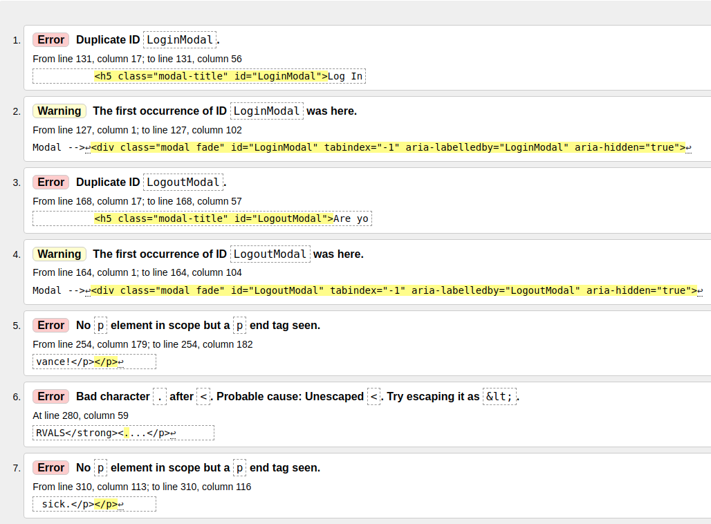

I investigated and refactored the code to fix these errors and after testing again these errors are no longer present. I also encountered another error that was present on the Add Post and Edit Post pages:

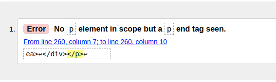

After investigating this error, I found that the 'p' element causing the issue was created when rendering the RichTextField of the form to the page. To fix this error I used [django-crispy-forms](https://django-crispy-forms.readthedocs.io/en/latest/) to render the form. I followed the setup instructions and replaced `{{ form.as_p }}` with `{{ form|crispy }}` on the html templates and after running the validator tests again the error is no longer present.

#### CSS

I tested all my own CSS files by direct input to avoid picking up any errors that may exist in external CSS files (Bootstrap etc.). There were no errors found in any of the CSS files.

### JSHint

I ran all the JavaSript files through [JSHint](https://jshint.com/) and I found a few warnings which were easy to resolve:

- There were multiple counts of 'missing semicolon' throughout the files which was an easy fix
- There are multiple warnings which remain present in the files about the use of `let` and `const` in JS version ES6 as follows: `let' is available in ES6 (use 'esversion: 6') or Mozilla JS extensions (use moz).` I found an article on stack overflow [here](https://stackoverflow.com/questions/27441803/why-does-jshint-throw-a-warning-if-i-am-using-const) that advises by adding `/*jshint esversion: 6 */ ` at the top of the javascript files it would clear this error. I implemented this solution while testing in JSHint and the warnings were no longer present.

### PEP8 Online

Throughtout the development of the project, I was regularly checking all my own Python code for PEP8 compliance with the [PEP8 online](http://pep8online.com/) checker before committing to GitHub. This tool was great for finding common errors like 'trailing whitespace', indent errors, line too long, blank line errors etc. After checking all the files again there are were no errors found.

## Web Browser and Device Testing

I tested the functionality of the website across a number of browsers and devices to verify that the website is responsive and the code is supported across different browsers.

- Browsers tested:
    - Google Chrome
    - Brave
    - Firefox
    - Microsoft Edge

- Devices Tested:
    - Laptop
    - Desktop
    - Samsung Galaxy S20
    - iPhone 11

When carrying out device testing with my Samsung Galaxy S20 mobile, I found that on the pages that displayed a list of posts (All Posts, Category pages, User Profile, My Feed), the post date element was sometimes spilling over to the line below it depending on the length of the post date element itself. 

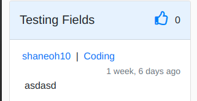

To fix this issue, I added a new post date element that is positioned below the author and category links as opposed to a span element on the same line, which is only displayed on smaller screen sizes and reverts back to the original span element for larger screens.

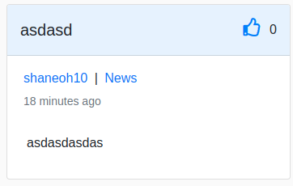

All website features are working across all browsers and devices tested and the website is responsive on all devices.

## Testing User Stories

User Story No. | As a User | I want to be able to | So that I can | Complete
---------------|-----------|----------------------|---------------|--------------
1|First Time User|immediately recognise the purpose of the site|decide if I am interested in using the site or not| :heavy_check_mark:
2|General User|easily navigate the website on various devices|browse the website without feeling lost or confused| :heavy_check_mark:
3|General User|view a list of post categories|choose which categories I am interested in| :heavy_check_mark:
4|General User|view all posts in a specific category|view the posts I am interested in| :heavy_check_mark:
5|General User|view individual posts|see all post details (comments, author, likes and date posted)| :heavy_check_mark:
6|General User|sort posts by date / popularity|view most recent or most popular posts| :heavy_check_mark:
7|General User|search the website|find and view specific posts, categories and users| :heavy_check_mark:
8|General User|easily register a new account|have the full website experience and contribute to the community| :heavy_check_mark:
9|Logged In User|easily log in / log out|access my own personal account| :heavy_check_mark:
10|Logged In User|create a new post|share content with other users and receive rewards| :heavy_check_mark:
11|Logged In User|comment on a post|personally respond to a post| :heavy_check_mark:
12|Logged In User|like a post|express that I like the content of the post| :heavy_check_mark:
13|Logged In User|follow users/categories|view content that I am interested in on my own personal feed| :heavy_check_mark:
14|Logged In User|send rewards to users for their posts|reward a user for posting good quality content| :heavy_check_mark:
15|Logged In User|receive rewards from users for my posts|be rewarded by other users for posting good quality content| :heavy_check_mark:
16|Logged In User|buy tokens with credit/debit card|add tokens to my account balance| :heavy_check_mark:
17|Logged In User|withdraw tokens as cash|convert my tokens to cash and withdraw to my bank account| :heavy_check_mark:
18|Logged In User|view order details when buying or withdrawing tokens|review my purchase/withdrawal| :heavy_check_mark:
19|Logged In User|receive email confirmation for purchases/withdrawals|keep record of successful transactions| :heavy_check_mark:
20|Logged In User|have a personal profile|view and customise my personal profile and account details| :heavy_check_mark:
21|Logged In User|edit/delete my own posts|edit any errors or remove my post completely| :heavy_check_mark:
22|Logged In User|reset password|access my account if I forget my password| :heavy_check_mark:
23|Logged In User|delete my account|delete my account if I no longer wish to use the website| :heavy_check_mark:
24|Administrator|edit/delete any posts|moderate the website / remove inappropriate content| :heavy_check_mark:

#### 1. As a first time user I want to immediately recognise the purpose of the site
- The home page displays a large hero image which shows a group of people socialising with their mobile phones and laptops and there is a heading which makes it clear that the website is used for sharing content
- If the user scrolls down the page or clicks on the learn more button, they are brought to an about section which gives the users a description of how the website works

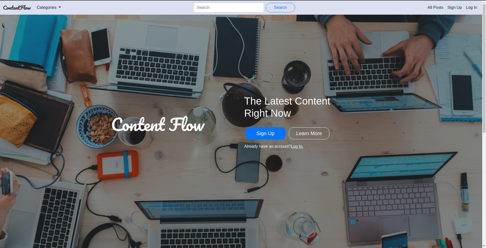

#### 2. As a general user I want to easily navigate the website on various devices
- The project uses the Bootstrap framework which is directed at responsive web development. On smaller screens, some of the page elements are hidden from view to save space and provide a pleasant experience.
- The navbar collapses into a small hamburger icon on smaller screens which expands when clicked so that users have access to all the navigation links on large and small screens.
- The navbar is fixed to the top of the window on all device sizes so that users will always have access to navigation links without having to scroll back to the top of the page.

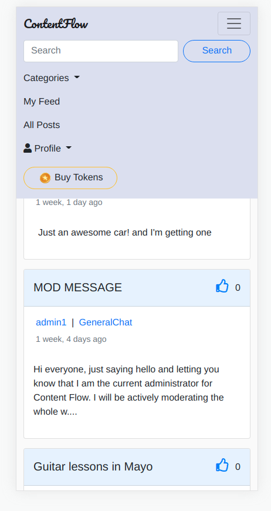

#### 3. As a general user I want to view a list of post categories
- There is a dropdown menu with a list of all post categories in the navbar. Each menu item is a link to the category page for that specific category.
- On larger screens, the category menu is also displayed to the right hand side of the main content for easy access.

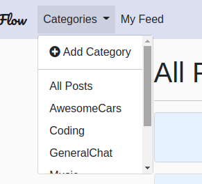

#### 4. As a general user I want to view all posts in a specific category
- When the user clicks on a category from the category menu, they are brought to that category page where only posts in that specific category are displayed.

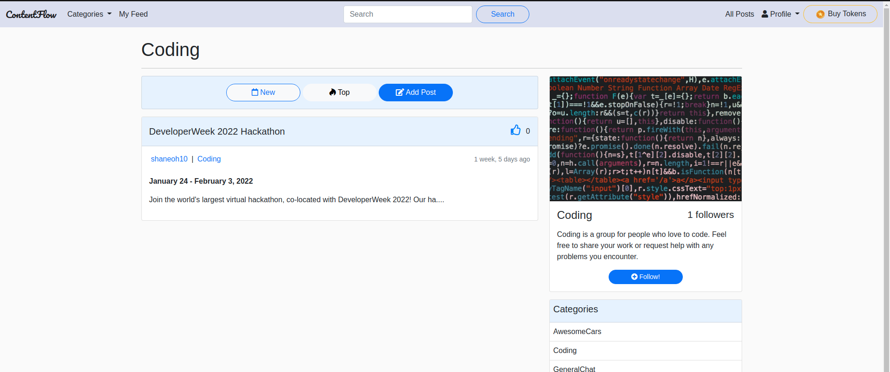

#### 5. As a general user I want to view individual posts
- When viewing a list of posts in the all posts page, my feed page or a specific category page, the user can click on the post title or the post image to view the individual post on its own page.
- On this page, users can view the full post, including any comments and on larger screens there is a card with the post author's details to the right of the main post.

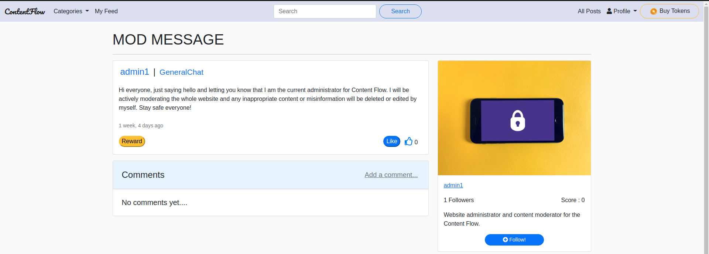

#### 6. As a general user I want to sort posts by date/popularity
- The default sorting for posts is set to `('-post_date')` which shows the most recent posts first on the list. On the category pages and all posts page, users can change the sorting between new and top, where new orders posts by newest post first and top orders the posts by the highest number of likes descending, showing the most popular posts first.
- The corresponding button for whatever sorting is active will be highlited in blue so that users are aware of which post sorting they are currently using.

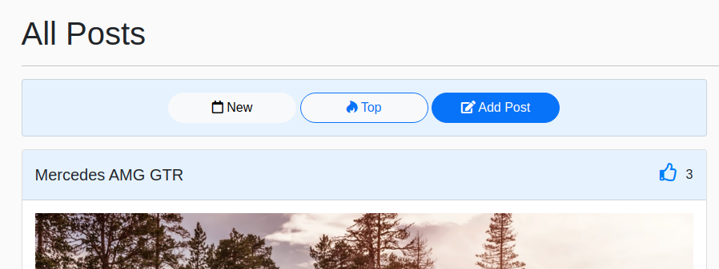

#### 7. As a general user I want to search the website
- A search bar is present in the navbar which gives users the ability to run a query through all of the posts on the website
- The query is run against post title, body, category and author username to maximise the chance that the user will find what they are looking for

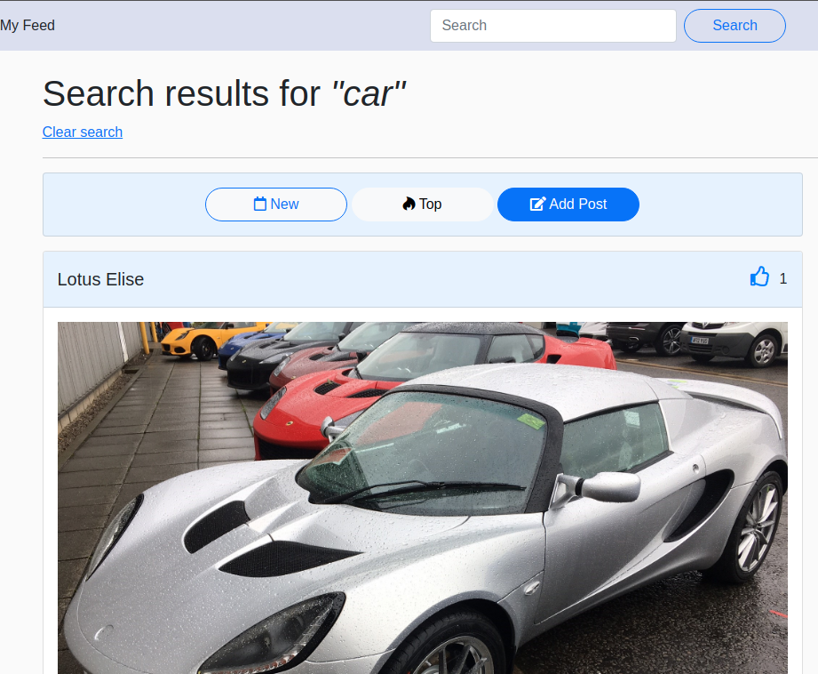

#### 8. As a general user I want to easily register a new account
- There are multiple links to the sign up page on the home page and in the navbar. The sign up page has a simple layout and the user will be prompted of any input errors in the form so they can be easily rectified
- The user registration is handled by django-allauth

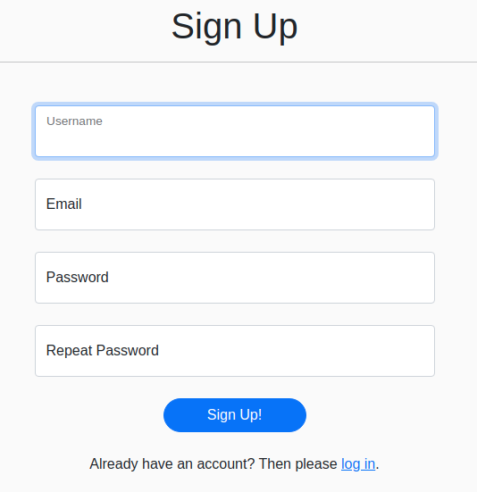

#### 9. As a logged in user I want to easily log in/out
- There are multiple links to log in on the home page and in the navbar. These links open up a login modal where the user can enter their credentials to log in to the website. If there are any errors logging in, the user is redirected to the log in page where errors in the form will be displayed.
- When a user is logged in, they can log out by pressing the log out button on the profile dropdown menu.
- The user log in/out functionality is all handled by django-allauth

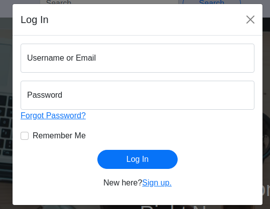

#### 10. As a logged in user I want to create a new post
- Logged in users can add a post by clicking the add post button at the top of the all posts page or category pages or the add post button in the profile menu on the navbar.
- This opens up the add post page which consists of a form that must fill out to add a new post to the website. They must choose a title, category and add content to the post body. There is also an optional image field in the form if users want to upload an image with their post.
- If a user that is not logged in tries to access the add post page they will be redirected to the login page

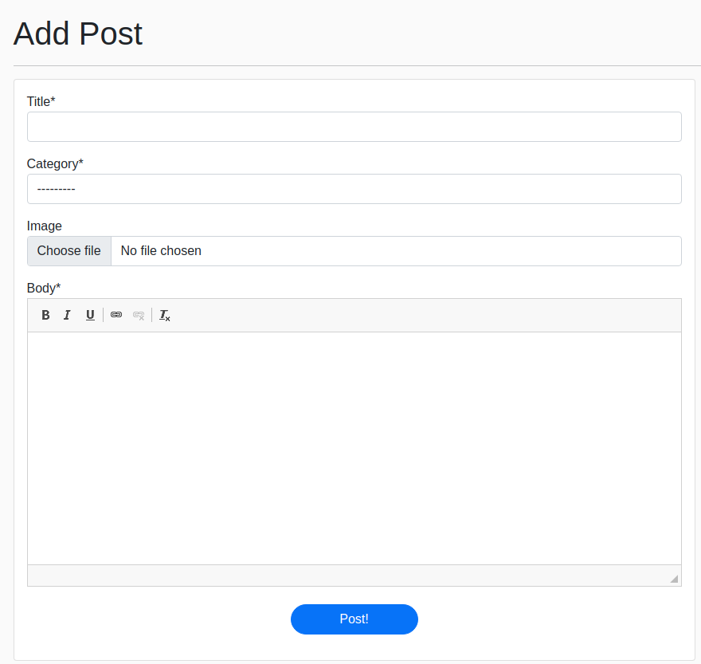

#### 11. As a logged in user I want to comment on a post
- When a user is on the post detail page for an individual post, they will see a comment section below the main post. Logged in users will see an 'add a comment' link which will bring the user to the Add Comment form. After the user has submitted the form their comment will appear in the comment section below the post they chose to comment on.
- If a user that is not logged in tries to access the add comment page they will be redirected to the login page

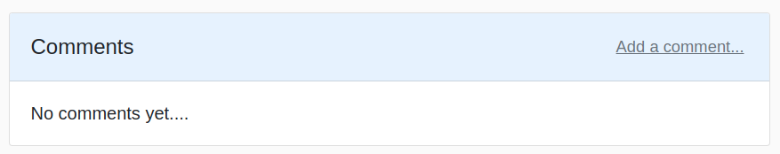

#### 12. As a logged in user I want to like a post
- When a logged in user is on the post detail page for an individual post, they will see a like button on the card with all the post details. To like the post the user just clicks the like button and the page will refresh with the button being changed to an unlike button, which lets the user know they have liked the post.
- If the user presses the unlike button their 'like' is then removed from the post
- A post can also be liked by clicking on the thumbs up icon on the post card when viewing posts as a list. (All posts page, category pages etc.)

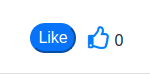
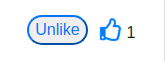

#### 13. As a logged in user I want to follow users/categories
- When viewing a category page, a card will be displayed with the category name, description and a follow button. This follow button allows the user to 'follow' that category, which adds all posts in that specific category to the users custom feed. The user can also 'unfollow' a category that they are currently following which will remove posts from that category from their custom feed.
- When viewing a specific post or user profile, a card will be displayed with the user's username, bio and a follow button. This follow button allows the user to 'follow' that user, which adds all posts created by that specific user to the users custom feed. The user can also 'unfollow' a user that they are currently following which will remove posts by that user from their custom feed.
- The list of posts for the user's custom feed is checked for repeat posts before the page is rendered which means a post will only be displayed once in the feed. This eliminates repeat posts if the user is following a category and also the author of a post within that category.

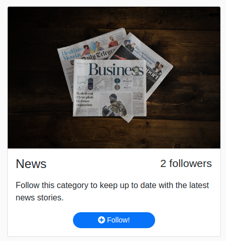

#### 14. As a logged in user I want to send rewards to users for their posts
- When viewing a specific post, logged in users will see a 'send reward' button on the post detail card. This button opens up a modal with a form that prompts the user to decide how many tokens they want to send to the post author as a reward. If the user has no tokens in their balance, they will be prompted to go to the tokens page to buy tokens.
- The form has validation built in to stop users trying to send more tokens than they have in their balance. When the form is submitted, the tokens will be deducted from the sending user's token balance and added to the receiving user's token balance and token score. A user's token score can only increase when they receive tokens as a reward, whereas their token balance can increase by receiving rewards and buying tokens. This process of transferring tokens has been validated by sending rewards between accounts and checking the token balances and scores via the django admin dashboard.

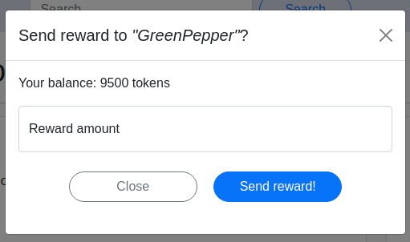

#### 15. As a logged in user I want to receive rewards from users for my posts
- Any user who creates a post is eligible to receive a reward. To increase the chances of receiving a reward the user should post good quality content. As explained above for user story 14, the sending and receiving of rewards between accounts has been tested and validated.

#### 16. As a logged in user I want to buy tokens with credit/debit card
- Any logged in user can view the tokens page by clicking the 'buy tokens' button in the navbar. From this page the user can choose from three set amounts, how many tokens they want to purchase. When the user selects how many tokens they want, a Stripe payment intent is created and they are redirected to the checkout page.
- From the checkout page the user can then fill in their details to complete the order. Stripe handles the payment authentication and the project is currently set up to use Stripe test cards only, so the card details entered must be from the stripe preset card list. During testing I used the basic test card of card number 4242 4242 4242 4242 and to test with card authentication required I used card number 4000 0027 6000 3184.
- Any errors with billing details or card details are displayed on the form to notify users of ther error so they can rectify it.
- When a purchase is successful, the user is redirected to the checkout success page which shows their order details and the user's token balance will increase by the amount of tokens they choose on their order. This is performed by using stripe webhooks which adds the tokens when stripe confirms receipt of payment.

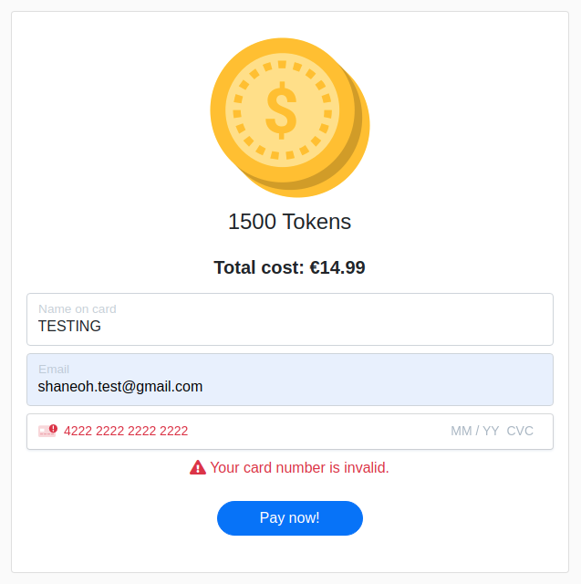

#### 17. As a logged in user I want to withdraw tokens as cash
- On the account settings page, there is a 'withdraw tokens' button which brings the user to the token withdrawal page. This page contains a from requesting informtaion from the user to make a withdrawal. For the purpose of the project and to protect users the 'Bank IBAN' field of the form is set to readonly with a sample IBAN.
- The user must choose how many tokens they want to withdraw and a cash amount is diplayed below the form to notify users how much money they will receive for their withdrawal. The form has validation built in to only allow a minimum token input of 1000 and a max of whatever the user's token balance is so they can not withdraw more than their token balance.
- When the user submits the form, they are redirected to the withdrawal success page which displays their withdrawal details. The token amount of the order is then deducted from the user's token balance.

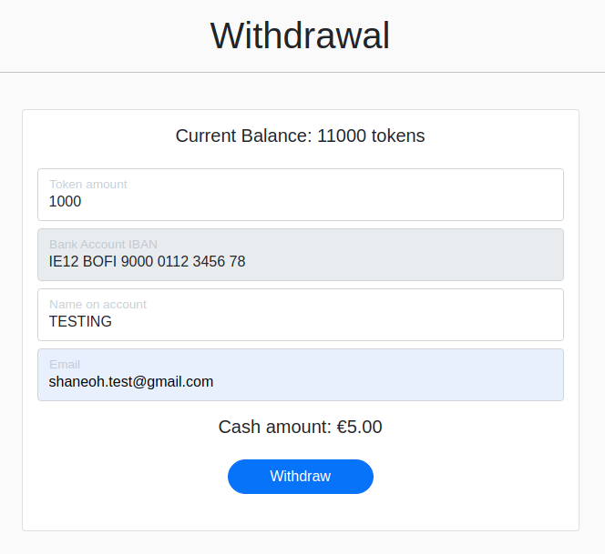

#### 18. As a logged in user I want to view order details when buying or withdrawing tokens
- When a user is buying tokens as explained and tested for user story 16, their order details are available to them on the form before the order is submitted. As the user can only purchase one product at a time, and it is clearly displayed on the form, there should be no confusion as to what product they are purchasing.
- When a user is withdrawing tokens as explained and tested for user story 17, their withdrawal details are available to them on the form before the withdrawal is submitted. As the user enters their own token amount and the cash value is clearly displayed on the form, there should be no confusion as to the value of the user's withdrawal.

#### 19. As a logged in user I want to receive email confirmation for purchases/withdrawals
- As part of the order and withdrawal procedures as explained in user stories 16 and 17, the user will also receive an email containing their order or withdrawal details. This confirmation email is sent to the email provided on the order/withdrawal forms and has been tested and is working correctly for both purchases and withdrawals.

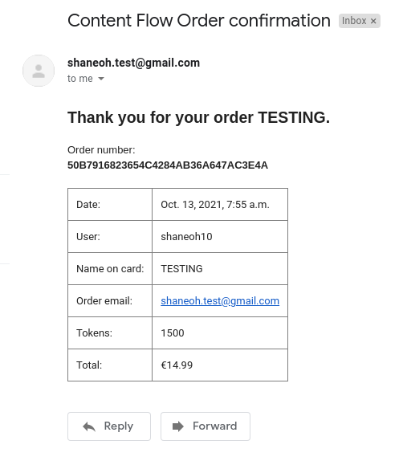

#### 20. As a logged in user I want to have a personal profile
- All registered users of the website have their own personal profile page which they can customise. The profile page displays all posts created by that user and it also contains a card with the user's profile picture and their user bio.
- The profile page can be customised by clicking in to the Settings page on the Profile dropdown menu. From here, users can change their profile picture and update their bio. When the update account button is pressed, the updated information is saved to the database and visible on the user's profile page.

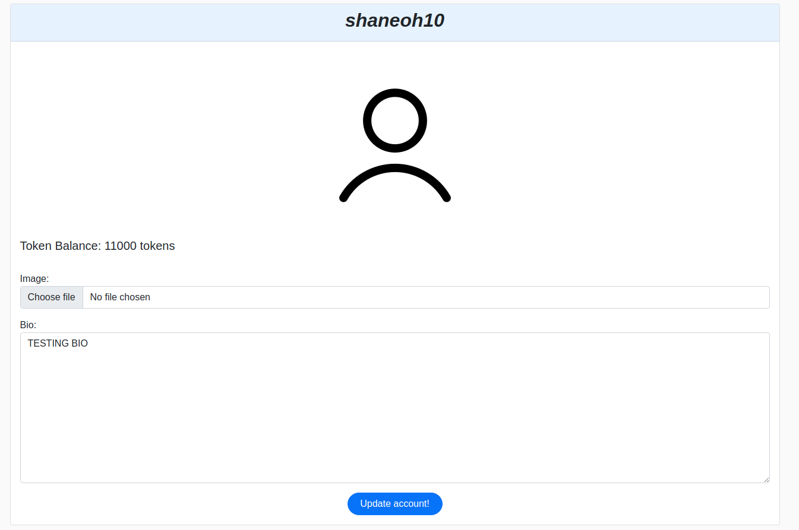

#### 21. As a logged in user I want to edit/delete my own posts
- When a user is on the post detail page for a post that they created, they will see an 'edit' and 'delete' links below the post pody. These buttons are not visible when viewing a post you did not create.
- The 'edit' link brings the user to and edit post page which contains a form that allows the user to make any changes to that specific post.
- The 'delete' link opens up a modal which prompts the user to confirm if they want to delete that specific post. If confirmed, the post is deleted from the database.
- If a user tries to edit or delete posts they did not create they will be prompted with a message that they are unable to do so.

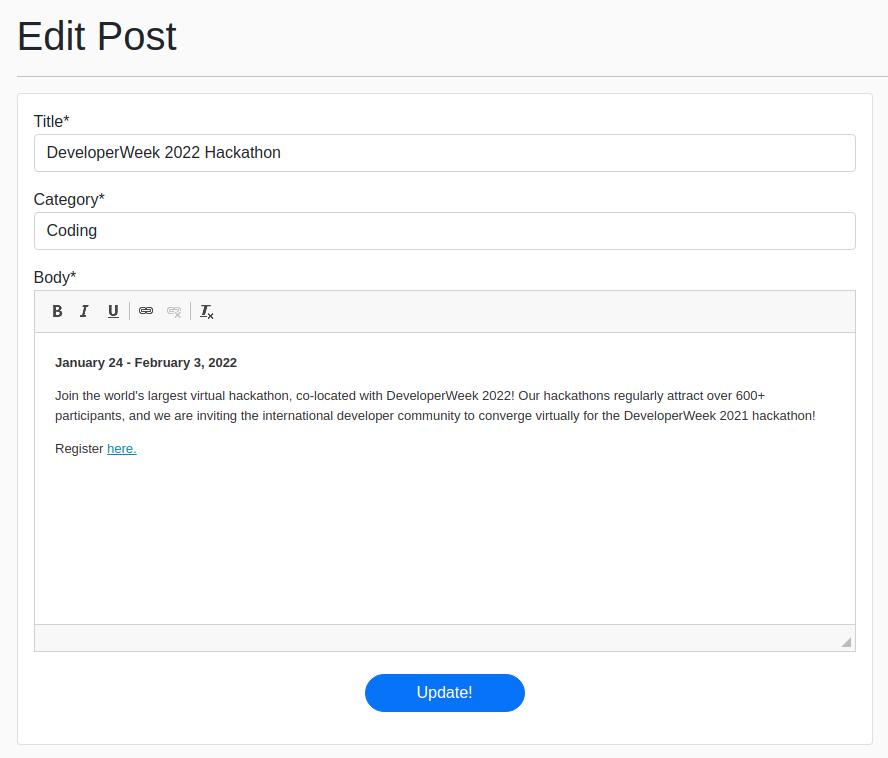

#### 22. As a logged in user I want to reset my password
- Users can reset their password in two ways. They can use the 'forgot password' link on the log in page or while logged in they can use the 'change password' button on the account settings page. 
- The 'forgot password' link will ask for the user's email address and send a password reset link to that email address, if that email address is attached to a user account on the database. The user can then reset their password via the link on the email.
- The 'change password' button will open up a password reset page where the user is prompted to enter their current password and a new password and they can submit the form to change their password.
- Password resets are handled by django-allauth

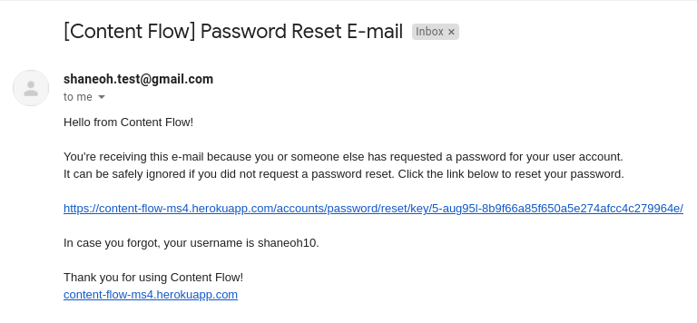

#### 23. As a logged in user I want to delete my account
- Users can delete their account from the account settings page when they are logged in. There is a 'delete account' button at the bottom of the page.
- This button opens up a modal prompting the user to confirm if they wish to delete their account and warning them that the action can not be reversed. When a user confirms to delete their account, their User account is deleted from the database which also deletes their UserProfile and any posts and comments they wrote.
- Users can only delete their own account and if a user tries to delete someone else's account a message will notify them that they are unable to do so.

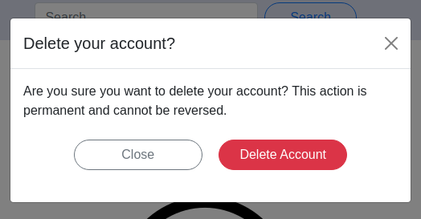

#### 24. As an Administrator I want to edit/delete any posts
- Administrators/Superusers have access to the 'edit' and 'delete' links for all posts on the website as eplained for user story 21, which means they have the ability to edit or delete any post on the website.
- Alternatively, administrators can log in to the django admin dashboard where they have full access to the database and CRUD functionality. This allows administators to moderate all content posted to the website.

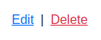

