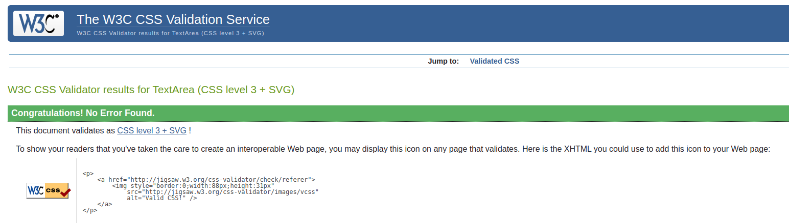

# Content Flow - Testing

[Back to README.md](README.md)

## Chrome Developer Tools

I used Chrome Developer Tools throughout the development of the project to assist with the design and layout of each page. This is a great tool to use when implementing or making changes to HTML and CSS code as it allows you to test various font sizes, margin, padding etc. before committing any changes to the project. I also found it very useful to help me find exactly which elements needed to be targeted in the DOM when making visual changes to the pages (JQuery effects, media queries etc.) and when getting input values from forms. I am satisfied with how the website turned out and I think it is clear and easy to read on mobile, tablet and desktop. Overall, I think the best experience is on desktop as there is no content hidden to save screen space but I believe the mobile experience is great for someone on the go as it contains all the most important content and is easy to read, navigate and interact with the website.

### Lighthouse

I ran tests across all pages with lighthouse for both mobile and desktop. Below is an example of some of the errors that were found:

These errors were due to having no website meta description and there were image elements missing "alt" attributes. There was also an issue with contrast between foreground and background colours found. These errors were easily rectified and after running the tests again I got the following results:

Across all of the website pages, the lighthouse results for desktop were very good, mostly similar to the results in the image above. There was, however, an issue with the results for the mobile tests. The mobile results consistently fell down for "Performance", with scores ranging from 65 up to 91. I found that the use of CDN's as well as the use of a lot of user uploaded images across the website which have not been optimized for web use was causing this performance issue. A combination of slower internet speed and a large amount of data to be loaded can increase loading times on mobile devices which can have an impact on user experience. As the website still functions correctly, and performance issues I found in physical device testing were minimal, I decided to take no further action but this is definitely something that needs to be considered if this website was ever to be launched to the public where the number of users could be a lot higher than it is now and real issues could occur.

## Validation

### W3C Validator

#### HTML

#### CSS

I tested all my own CSS files by direct input to avoid picking up any errors that may exist in external CSS files (Bootstrap etc.). There were no errors found in any of the CSS files.

### JSHint

I ran all the JavaSript files through JSHint and I found a few warnings which were easy to resolve:

- There were multiple counts of 'missing semicolon' throughout the files which was an easy fix
- There are multiple warnings which remain present in the files about the use of `let` and `const` in JS version ES6 as follows: `let' is available in ES6 (use 'esversion: 6') or Mozilla JS extensions (use moz).` I found an article on stack overflow [here](https://stackoverflow.com/questions/27441803/why-does-jshint-throw-a-warning-if-i-am-using-const) that advises by adding `/*jshint esversion: 6 */ ` at the top of the javascript files it would clear this error. I implemented this solution while testing in JSHint and the warnings were no longer present.

